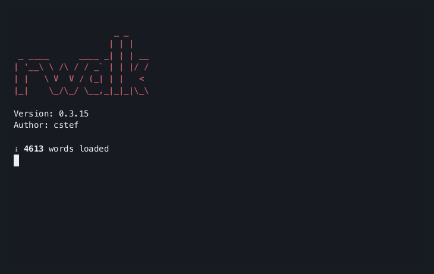

<p align="center">
    
</p>

[](https://crates.io/crates/rwalk)
[](LICENSE)
[](https://github.com/cestef/rwalk/releases/latest)

A blazingly fast web directory scanner written in Rust. It's like [dirsearch](https://github.com/maurosoria/dirsearch) but faster and with less features.
It is designed to be fast in [**recursive scans**](#recursive-scan) and to be able to handle large wordlists.

Unlike other tools, rwalk does **<u>not</u>** provide advanced fuzzing features such as **parameter fuzzing**, **header discovery**, etc.

<p align="center">
    
</p>

## Features <!-- omit in toc -->

- [x] Multi-threaded
- [x] Recursive directory scanning
- [x] Save progress to resume later
- [x] Cherry-pick responses (filter by status code, length, etc.)
- [x] Advanced filters (regex, json, ranges, etc.)
- [x] Custom wordlists (merge multiple wordlists, filter out words, etc.)
- [x] Write results to file (JSON, CSV, etc.)
- [x] Configurable request parameters (headers, cookies, etc.)
- [x] Request throttling
- [x] Proxy support

## Table of Contents <!-- omit in toc -->

- [Installation](#installation)
- [Usage](#usage)
  - [Scanning modes](#scanning-modes)
  - [Response Filtering](#response-filtering)
  - [Additional response details](#additional-response-details)
  - [Ranges](#ranges)
  - [Wordlists](#wordlists)
  - [Scripting](#scripting)
  - [Miscellaneous](#miscellaneous)
- [Examples](#examples)
- [Installing completions](#installing-completions)
- [FAQ](#faq)
- [Benchmarks](#benchmarks)
- [Contributing](#contributing)
- [License](#license)

## Installation

### From [homebrew](https://brew.sh) <!-- omit in toc -->

```bash
brew install cestef/tap/rwalk
```

### With [`cargo-binstall`](https://github.com/cargo-bins/cargo-binstall) <!-- omit in toc -->

```bash
cargo binstall rwalk
```

### From [crates.io](https://crates.io/crates/rwalk) <!-- omit in toc -->

```bash
cargo install rwalk
```

### From source <!-- omit in toc -->

```bash
git clone https://github.com/cestef/rwalk.git
cd rwalk
cargo install --path .
```

<small>
    <p align="center">
        <i>You can also download the latest binary from the <a href="https://github.com/cestef/rwalk/releases/latest">releases page</a>.</i>
    </p>
</small>

## Usage

You can run `rwalk --help` or [read the help file](HELP.md) for more information.

### Scanning modes

#### Recursive scan <!-- omit in toc -->

By default `rwalk` will use a recursive-like scan. You can change the depth of the scan with the `--depth` (`-d`) flag:

```bash
rwalk https://example.com wordlist.txt -d 3
```

The recursive mode only scans urls [identified as directories](src/runner/filters.rs#L412). If you are not happy with the default behavior, you can either use the `--force-recursion` (`--fr`) flag to force the recursion on all found urls, or provide your own detection algorithm in `rhai` with [`--directory-script`](#directory-script) (`--ds`).


#### Classic scan <!-- omit in toc -->

In case you want to fuzz more precise paths, you can either use the `--mode classic` flag or provide a fuzzing placeholder in the URL. For example:

```bash
rwalk https://example.com/$ wordlist.txt
```

Notice that the `$` character is used to indicate the position of the wordlist in the URL.
This character is the default, but it can be changed with the following format:

```bash
rwalk https://example.com/W1 wordlist.txt:W1
```

In this case, the `W1` string will be replaced by the first word in the wordlist.

You can also use this to replace with multiple wordlists:

```bash
rwalk https://example.com/W1/W2 wordlist1.txt:W1 wordlist2.txt:W2
```

`W1` will be replace by the words in `wordlist1.txt` and `W2` by the words in `wordlist2.txt`.

To use the same wordlist in multiple places, you can use the following format:

```bash
rwalk https://example.com/W1/W2 wordlist.txt:W1,W2
```

This will generate all possible combinations of the wordlist at `W1` and `W2`.

#### Spider scan <!-- omit in toc -->

A spider scan consists of scanning all the links found in the responses. This can be achieved with the `--mode spider` flag:

```bash
rwalk https://example.com --mode spider -d 3
```

Note that the spider scan does not need any wordlist as it will use the links found in the responses.

Just as with the recursive scan, you need to specify until which depth you want to scan with the `--depth` (`-d`) flag.

By default, The links are extracted from the following attributes: `href`, `src`, `content`, `data-src`. You can change this behavior with the `--attributes` (`-a`) flag.

### Response Filtering

To cherry-pick the responses, you can use the `--filter` (`-f`) flags to filter specific responses. For example, to only show responses that contain `admin`:

```bash
rwalk ... --filter contains:admin
```

or only requests that took more than `1` second:

```bash
rwalk ... --filter "time:>1000"
```

Available filters:

- `starts`: _`<STRING>`_
- `ends`: _`<STRING>`_
- `contains`: _`<STRING>`_
- `regex`: _`<REGEX>`_
- `length`: _`<RANGE>`_
- `status`: _`<RANGE>`_
- `time`: _`<RANGE>`_
- `hash`: _`<STRING>`_ _MD5 hash of the body_
- `header`: _`<STRING>=<STRING>`_
- `url`: _`<STRING>`_
- `type`: _`<STRING>`_
- `lines`: _`<RANGE>`_
- `similarity`: _`<WORD>:<RANGE>`_ _Similarity of the body to the provided word_
- `json`: _`<PATH>=<STRING>`_ _Match the value at the provided path in the JSON body_
- `depth`: _`<RANGE>`_

Each filter can be negated by adding a `!` before the filter. For example, to exclude responses that contain `admin`:

```bash
rwalk ... --filter "!contains:admin"
```

To match against bodies

You can also filter only at specific depths with the `[depth]filter` format. For example, to only show responses that contain `admin` at depth `2`:

```bash
rwalk ... --filter "[2]contains:admin"
```

> [!NOTE]
> Depth starts at `0`.

### Additional response details

If you need more details about the matched responses, you can use the `--show` flag. For example, to show the body hash and length:

```bash
rwalk ... --show hash --show length
```

Available details:

- `length`
- `hash`
- `headers`
- `body`
- `headers_length`
- `headers_hash`
- `type`
- `cookies`
- `similarity:<WORD>` _Similarity of the body to the provided word_

### Ranges

In some cases , you may want to input a `<RANGE>` of values.
You can use the following formats:

| Format       | Description                                               |
| :----------- | :-------------------------------------------------------- |
| `5`          | Exactly `5`                                               |
| `5-10`       | Between `5` and `10` (inclusive)                          |
| `5,10`       | Exactly `5` or `10`                                       |
| `>5`         | Greater than `5`                                          |
| `<5`         | Less than `5`                                             |
| `5,10,15`    | Exactly `5`, `10`, or `15`                                |
| `>5,10,15`   | Greater than `5`, or exactly `10` or `15`                 |
| `5-10,15-20` | Between `5` and `10` or between `15` and `20` (inclusive) |

### Wordlists

You can pass multiple wordlists to `rwalk`. For example:

```bash
rwalk https://example.com wordlist1.txt wordlist2.txt
```

`rwalk` will merge the wordlists and remove duplicates. You can also apply filters and transformations to the wordlists (see below).

You can also pass wordlists from stdin:

```bash
cat wordlist.txt | rwalk https://example.com -
```

> [!NOTE]
> A checksum is computed for the wordlists and stored in case you abort the scan. If you resume the scan, `rwalk` will only load the wordlists if the checksums match. See [Saving and Resuming scans](#saving-and-resuming-scans) for more information.

#### Filters <!-- omit in toc -->

You can filter words from the wordlist by using the `--wordlist-filter` (`-w`) flag. For example, to only use words that start with `admin`:

```bash
rwalk ... --wordlist-filter starts:admin
```

The filters are applied to all wordlists by default. This behavior can be controlled with the `[key]filter` format. For example, to only use words that start with `admin` from the second wordlist:

```bash
rwalk wordlist1.txt:W1 wordlist2.txt:W2 -w "[W2]starts:admin"
```

Available filters:

- `starts`: _`<STRING>`_
- `ends`: _`<STRING>`_
- `contains`: _`<STRING>`_
- `regex`: _`<REGEX>`_
- `length`: _`<RANGE>`_

#### Transformations <!-- omit in toc -->

To quickly modify the wordlist, you can use the `--transform` (`-T`) flag. For example, to add a suffix to all words in the wordlist:

```bash
rwalk ... --transform suffix:.php
```

To replace all occurrences of `admin` with `administrator`:

```bash
rwalk ... --transform replace:admin=administrator
```

Just as in the wordlist filters, the transformations are applied to all wordlists by default. This behavior can be controlled with the `[key]transform` format. For example, to add a suffix to all words in the second wordlist:

```bash
rwalk wordlist1.txt:W1 wordlist2.txt:W2 -T "[W2]suffix:.php"
```

Available transformations:

- `prefix`: _`<STRING>`_
- `suffix`: _`<SUFFIX>`_
- `remove`: _`<STRING>`_
- `replace`: _`<OLD=NEW>`_
- `upper`
- `lower`
- `capitalize`
- `reverse`

### Scripting

`rwalk` supports scripting with [`rhai`](https://github.com/rhaiscript/rhai).

#### Response scripts <!-- omit in toc -->

These scripts will be ran after a successful (passing all filters) response is received. The script will have access to the following variables:

- `data` [TreeData](src/utils/tree.rs#L24): The response data
  - `url`
  - `depth`
  - `path`
  - `status_code`
  - `extra`
  - `url_type`
- `opts` [Opts](src/cli/opts.rs#L22): The options passed to `rwalk`


#### Interactive mode <!-- omit in toc -->

When using the `--interactive` (`-i`) flag, you can run scripts with the `eval` command. For example:

```bash
rwalk ... -i
```

```bash
> eval print('Hello, world!')
```

Will print `Hello, world!` to the terminal.

> [!NOTE]
> Passing no arguments to the `eval` command will start an interactive mode for scripting.

You have access to the following variables in the script:

- `tree` [TreeNode](src/utils/tree.rs#L18): The previous scan data if any representing the root node of the tree
  - `data` [TreeData](src/utils/tree.rs#L24)
  - `children` Vec<[TreeNode](src/utils/tree.rs#L18)>

#### Directory scripts <!-- omit in toc -->

This script will be ran for each url to determine if it is a directory or not. It will have access to the following variables:

- `response` [ScriptingResponse](src/runner/filters.rs#L422): The response data (more compact version of reqwest's `Response`)
- `opts` [Opts](src/cli/opts.rs#L22): The options passed to `rwalk`

### Miscellaneous

#### Interactive mode <!-- omit in toc -->

You can use the `--interactive` (`-i`) flag to enter interactive mode. In this mode, you can set parameters one by one and run the scan when you're ready.

Available commands:

- `set <PARAM> <VALUE>`: Set a parameter
- `append <PARAM> <VALUE>`: Append a value to a Vec parameter
- `unset <PARAM>`: Unset a parameter
- `list`: Show the current parameters
- `run`: Run the scan
- `exit`: Exit interactive mode
- `help`: Show help
- `clear`: Clear the screen


#### Output <!-- omit in toc -->

By default, `rwalk` will print the results to the terminal. You can also save the results to a file with the `--output` (`-o`) flag:

```bash
rwalk https://example.com wordlist.txt -o results.json
```

Available output formats:

- `*.json`
- `*.csv`
- `*.md`
- `*.txt`

> [!NOTE]
> For JSON output, you can use the `--pretty` flag to pretty-print the JSON.

#### Throttling <!-- omit in toc -->

The throttling value will be multiplied by the number of threads. For example, if you have `10` threads and a throttling value of `5`, the total number of requests per second will be `50`.

```bash
rwalk https://example.com wordlist.txt --throttle 5 -t 10
```

#### Saving and resuming scans <!-- omit in toc -->

By default, if you abort the scan with <kbd>Ctrl</kbd> + <kbd>C</kbd>, rwalk will save the progress to a file called `.rwalk.json`. You can resume the scan by running with `--resume`:

```bash
rwalk --resume
```

If you want to save the progress to a different file, you can use the `--save-file` flag:

```bash
rwalk https://example.com wordlist.txt --save-file myscan.json
```

The auto-saving behavior can be disabled with `--no-save`.

#### Proxy support <!-- omit in toc -->

You can pass a proxy URL with the `--proxy` flag:

```bash
rwalk https://example.com wordlist.txt --proxy http://pro.xy:8080
```

Authentication is also supported with `--proxy-auth`:

```bash
rwalk https://example.com wordlist.txt --proxy http://pro.xy:8080 --proxy-auth username:password
```


#### Passing parameters from a config <!-- omit in toc -->

The configuration file located at `~/.config/rwalk/config.toml` will be loaded by default. You can also pass a custom configuration file with the `--config` flag:

```bash
rwalk https://example.com wordlist.txt --config myconfig.toml
```

## Examples


### Basic scan <!-- omit in toc -->

```bash
rwalk https://example.com wordlist.txt
```


### Recursive scan <!-- omit in toc -->

```bash
rwalk https://example.com wordlist.txt -d 3
```

> **Warning:** Recursive scans can take a long time and generate a lot of traffic. Use with caution.


### Custom headers/cookies <!-- omit in toc -->

```bash
rwalk https://example.com wordlist.txt -H "X-Forwarded-For: 203.0.113.195" -c "session=1234567890"
```


### Follow redirects <!-- omit in toc -->

```bash
rwalk https://example.com wordlist.txt -R 2
```


### Custom request body <!-- omit in toc -->

```bash
rwalk https://example.com wordlist.txt -X POST -D '{"username": "admin", "password": "admin"}'
```

## Installing completions

Based on the shell you are using, you can install completions with the following commands:

<details>
<summary>Bash</summary>

```bash
rwalk --completions bash > /usr/local/etc/bash_completion.d/
```
</details>

<details>
<summary>Fish</summary>

```bash
rwalk --completions fish > ~/.config/fish/completions/rwalk.fish
```
</details>

<details>
<summary>Zsh</summary>

```bash
rwalk --completions zsh > /usr/local/share/zsh/site-functions/_rwalk
```

You may need to add the following line to your `.zshrc` file:

```bash
fpath+=/usr/local/share/zsh/site-functions
```
</details>

<details>

<summary>Nushell</summary>

```bash
mkdir $"($nu.default-config-dir)/completions"; rwalk --completions nushell | save $"($nu.default-config-dir)/completions/rwalk.nu" -f; echo 'source $"($nu.default-config-dir)/completions/rwalk.nu"' | save -a $nu.config-path
```

This script will create a `completions` directory in the default config directory, save the completions file there, and add the source command to the config file.
</details>

## FAQ

### Where can I find wordlists? <!-- omit in toc -->

- [SecLists](https://github.com/danielmiessler/SecLists)
- [DirBuster](https://gitlab.com/kalilinux/packages/dirbuster)
- [OneListForAll](https://github.com/six2dez/OneListForAll)

### How do I get support? <!-- omit in toc -->

Open an issue or ask in the [Discord server](https://cstef.dev/discord).

### Is rwalk stable? <!-- omit in toc -->

rwalk is stable but it's still in the early stages of development. It should work for most use cases but there may be bugs.

### Where can I test this tool? <!-- omit in toc -->

You can use the [ffuf.me](http://ffuf.me) website to test rwalk.
I also wrote a [blog post](https://blog.cstef.dev/posts/web-scanning-efficiently) about it with a few cool examples.

## Benchmarks

The following benchmarks were run on a 2023 MacBook Pro with an M3 Pro chip on a 10 Gbps connection via WiFi. The target was [http://ffuf.me/cd/basic](http://ffuf.me/cd/basic) and the wordlist was [common.txt](https://github.com/danielmiessler/SecLists/blob/master/Discovery/Web-Content/common.txt).

Each tool was run `10` times with `100` threads. The results are below:

| Command     |      Mean [s] | Min [s] | Max [s] |    Relative |
| :---------- | ------------: | ------: | ------: | ----------: |
| `rwalk`     | 2.406 ± 0.094 |   2.273 |   2.539 |        1.00 |
| `dirsearch` | 8.528 ± 0.149 |   8.278 |   8.743 | 3.54 ± 0.15 |
| `ffuf`      | 2.552 ± 0.181 |   2.380 |   3.005 | 1.06 ± 0.09 |

If you want to run the benchmarks yourself, you can use the `bench` command:

```bash
just bench
```

Positional arguments can also be passed.

```bash
just bench <URL> <WORDLIST_FILE> <THREADS>
```

Please take these results with a grain of salt.

> <i> "There are three types of lies: lies, damned lies and benchmarks"</i>

## Contributing

_Contributions are welcome! I am always looking for new ideas and improvements._

If you want to contribute to rwalk, please read the [CONTRIBUTING.md](CONTRIBUTING.md) file.

Make sure that your commits follow the [Conventional Commits](https://www.conventionalcommits.org/en/v1.0.0/) standard.
This project uses [commitizen](https://commitizen-tools.github.io/commitizen/) to help you with that.

## License

Licensed under the [MIT License](LICENSE).
